# 🏙️ Smart Public Infrastructure Issue Reporting System

An intelligent civic issue reporting platform designed to help citizens report public infrastructure problems and enable authorities to efficiently manage, assign, track, and resolve those issues.

## 🎯 Project Objective

The system provides a centralized platform for reporting and managing civic infrastructure issues such as:

- 🚧 Road damage
- 💡 Street light problems
- 🗑️ Waste management issues
- 🚰 Water-related problems
- 🚦 Traffic infrastructure issues
- 🏗️ Other public infrastructure problems

## 🏗️ System Architecture

The application follows a modern client-server architecture:

**Frontend → REST API → FastAPI Backend → PostgreSQL Database**

## 🗄️ Database Design

The system uses **PostgreSQL** as the relational database.

The database contains entities for users, civic issues, assignments, issue images, status history, notifications, and feedback.

### Entity Relationship Diagram



### Editable ER Diagram

The editable source diagram is available here:

`docs/diagrams/ER_DIAGRAM.drawio`

## ⚙️ Technology Stack

### Backend
- Python
- FastAPI
- SQLAlchemy
- Pydantic
- JWT Authentication

### Database
- PostgreSQL

### Development Tools
- Visual Studio Code
- Git
- GitHub
- Swagger / OpenAPI

## 🔐 Security

The system uses authentication and authorization mechanisms to protect user accounts and API resources.

Planned security features include:

- Password hashing
- JWT-based authentication
- Role-based authorization
- Protected API endpoints
- Input validation

## 📊 Core Modules

1. User Management
2. Citizen Authentication
3. Civic Issue Reporting
4. Issue Assignment
5. Issue Status Tracking
6. Issue Image Management
7. Notifications
8. Feedback
9. Administrative Management

## 🚀 Project Status

### Completed
- [x] PostgreSQL database setup
- [x] SQLAlchemy database connection
- [x] Users table
- [x] Issues table
- [x] FastAPI backend
- [x] User creation API
- [x] Issue creation API
- [x] Swagger API documentation
- [x] ER Diagram

### In Progress
- [ ] JWT authentication
- [ ] Role-based authorization
- [ ] Protected endpoints
- [ ] Advanced issue management
- [ ] Frontend integration

## 📁 Project Structure

```text
smart-civic-issue-reporting/
│
├── backend/
│   └── app/
│       ├── models/
│       ├── routes/
│       ├── schemas/
│       ├── services/
│       ├── config.py
│       ├── database.py
│       ├── main.py
│       └── security.py
│
├── docs/
│   ├── diagrams/
│   │   ├── ER_DIAGRAM.drawio
│   │   ├── ER_DIAGRAM.svg
│   │   └── SYSTEM_ARCHITECTURE.svg
│   ├── DOMAIN_STUDY.md
│   └── TECH_STACK.md
│
├── Problem_Statement.md
├── requirements.txt
├── README.md
└── .gitignore