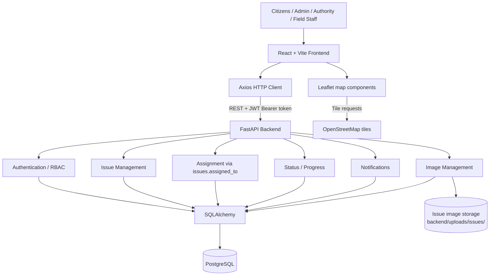

# System Architecture

## 1. Overview

The Smart Public Infrastructure Issue Reporting System is a local web application for reporting, reviewing, assigning, tracking, and updating public infrastructure issues.

The implemented architecture is a client-server system:

- A React + Vite frontend provides the browser interface.
- Axios sends HTTP requests to the backend and attaches the JWT Bearer token for protected calls.
- A FastAPI backend exposes REST endpoints, validates requests, authenticates users, applies role and ownership checks, and coordinates application operations.
- SQLAlchemy provides database access to PostgreSQL.
- PostgreSQL stores users, issues, issue updates, issue images, departments, and notifications.
- Issue evidence files are stored in the backend runtime upload directory and referenced by database image records.
- Leaflet and OpenStreetMap provide the map-selection and saved-location display features.

The application is implemented as one frontend, one FastAPI backend, one PostgreSQL database, and local filesystem storage for issue evidence images. It does not use microservices, a message broker, a separate notification provider, or a verified public deployment.

## 2. High-Level Architecture

The main request path is:

```text
Citizen / Admin / Authority / Field Staff
                    |
                    v
          React + Vite Frontend
                    |
          Axios HTTP client
          REST + JWT Bearer token
                    |
                    v
             FastAPI Backend
          /      |          \
         v       v           v
 Authentication  Application  Image-management
 and RBAC        routes        workflow
                 and services       |
                       |             +--> local issue-image storage
                       v
                   SQLAlchemy
                       |
                       v
                  PostgreSQL
```

The backend mounts the implemented route modules for users, authentication, issues, departments, issue images, and notifications. The issue routes coordinate issue creation, listing, assignment, status changes, progress updates, and issue retrieval.

Two supporting paths also exist:

- The frontend map components use Leaflet to render a map and OpenStreetMap tile URLs to display map tiles.
- The image route validates multipart uploads, writes accepted files under `backend/uploads/issues/`, and stores an `issue_images` record containing the issue relationship, generated filename, and image URL.

The active assignment workflow writes the Field Staff user ID to `issues.assigned_to`. The legacy `assignments` model and router remain in the repository but the legacy router is intentionally not mounted by `backend/app/main.py`.

## 3. Layered Architecture

The repository uses a practical layered structure. It is not a strict clean-architecture implementation: several route handlers coordinate directly with SQLAlchemy models, while notification and image operations also use service and repository modules.

### Presentation Layer

The presentation layer is implemented in `frontend/src/`.

It includes:

- React pages for login, registration, citizen dashboard, reporting, personal issues, Issue Details, notifications, Admin Dashboard, Authority Dashboard, and Field Staff Dashboard.
- React Router routes defined in `frontend/src/App.jsx`.
- Shared components such as `Navbar`, `ProtectedRoute`, `LocationPicker`, and `IssueLocationMap`.
- Forms for authentication, issue reporting, map selection, evidence-file selection, status changes, progress updates, and image deletion.
- Role-specific dashboard views and client-side role visibility checks.
- Axios communication through `frontend/src/services/api.js`.

The frontend stores the returned access token and user information in local browser storage. The Axios request interceptor adds `Authorization: Bearer <token>` when a token is available and removes the default JSON content type for `FormData` image requests.

### API / Backend Layer

The API layer is implemented with FastAPI in `backend/app/`.

The mounted route groups include:

- `/auth` for registration, JSON login, and the Swagger OAuth2 token flow.
- `/users` for user-related operations.
- `/issues` for issue creation, retrieval, assignment, status, and progress operations.
- `/departments` for the department route module.
- `/issues/{issue_id}/images` for issue-specific image upload, retrieval, and deletion.
- `/notifications` for notification list, unread count, and mark-as-read operations.
- `/health` for the backend health response.

FastAPI receives JSON request bodies for normal issue and status operations, validates them with Pydantic schemas, resolves database sessions through the `get_db` dependency, and returns JSON responses. Multipart form data is used for issue evidence-image uploads.

### Business/Application Layer

Business behavior is split between route handlers and supporting service modules rather than a separate domain service framework.

Implemented application behavior includes:

- Registration, password hashing, login, and JWT creation.
- JWT verification and current-user lookup.
- Role and ownership checks.
- Citizen issue creation and reporter association.
- Admin and authority issue listing.
- Active Field Staff assignment through `Issue.assigned_to`.
- Field Staff assigned-issue retrieval.
- Status validation and status-history records in `issue_updates`.
- Progress-message creation and optional status changes.
- Notification creation for issue, assignment, status, and progress events.
- Image validation, file storage, image-record creation, retrieval, and authorized deletion.

`notification_service.py` delegates notification persistence and retrieval to `notification_repository.py`. `issue_image_service.py` delegates image-record operations to `issue_image_repository.py`. Assignment service/repository modules exist for the legacy assignment model, but the active mounted issue-assignment route writes `issues.assigned_to` directly.

### Data Access Layer

SQLAlchemy is the implemented data-access technology.

- `backend/app/database.py` loads the environment, reads `DATABASE_URL`, creates the SQLAlchemy engine, creates `SessionLocal`, and exposes the `get_db` session dependency.
- Models inherit from the shared SQLAlchemy declarative base.
- Route handlers, services, and repositories use SQLAlchemy sessions for queries and persistence.
- The application calls `Base.metadata.create_all(bind=engine)` during backend startup for the declared models.

The codebase contains both direct model access in route handlers and repository-backed service operations. The architecture should therefore be understood as a modular application layer over SQLAlchemy, not as a fully separated repository-only data layer.

### Data Storage Layer

The data-storage layer has two parts:

1. **PostgreSQL database**
   - Stores structured user, issue, status/progress, image-reference, department, assignment-model, and notification data.
2. **Local issue-image filesystem storage**
   - Stores accepted evidence files under `backend/uploads/issues/`.
   - FastAPI exposes that runtime directory at `/uploads/issues`.
   - Database records in `issue_images` connect a stored file URL and generated filename to an issue.

Runtime uploads and local environment files are not source-code artifacts and are excluded from the committed project tree.

## 4. Authentication and Authorization Architecture

Authentication establishes who the caller is. Authorization determines what that authenticated caller may do.

### Registration

`POST /auth/register` accepts a name, email, and password. New users are created with the `citizen` role. The password is transformed into a bcrypt hash before persistence; the plaintext password is not stored by the application.

### Login and JWT authentication

`POST /auth/login` accepts JSON email and password values. The backend:

1. Finds the user by email.
2. Verifies the submitted password against the stored bcrypt hash.
3. Creates a JWT with the user ID and role in its payload.
4. Returns the access token as a Bearer token response.

`POST /auth/token` provides the OAuth2 password-flow form expected by FastAPI Swagger UI.

Protected requests use an HTTP Bearer token. The shared authentication dependency verifies the JWT, reads the subject user ID, loads the user from PostgreSQL, and rejects missing, invalid, expired, or unusable credentials.

### Password security

Password hashing uses PassLib with bcrypt. The backend requires `SECRET_KEY` from the environment for JWT signing and does not use an insecure fallback value.

### Roles and authorization

The implemented application represents these roles:

- **citizen** — may register, log in, create issues, view personal reports, and operate on owned issue evidence within the implemented checks.
- **admin** — may view all issues, assign Field Staff, and use administrative issue-management operations.
- **authority** — may access the implemented all-issue viewing workflow and Authority Dashboard restrictions.
- **field_staff** — may retrieve issues assigned to that user through `issues.assigned_to` and update assigned issue status/progress.

The `require_role` dependency enforces endpoint role requirements. Additional route-level checks enforce reporter ownership or Field Staff assignment. For example, Field Staff status/progress operations require that `issue.assigned_to` match the authenticated Field Staff user.

## 5. Issue Reporting Flow

The implemented issue workflow is:

```text
Citizen registers/logs in
        ↓
Citizen creates an issue
        ↓
Category, title, description, priority, severity, and optional location text
        ↓
Optional map coordinate selection
        ↓
Optional evidence-image selection
        ↓
Issue submitted to FastAPI
        ↓
Issue validated and stored in PostgreSQL
        ↓
Admin/authority users can review the issue
        ↓
Admin assigns Field Staff through issues.assigned_to
        ↓
Assigned Field Staff retrieves the issue
        ↓
Field Staff updates status and/or progress
        ↓
Reporter receives status/progress notifications
        ↓
Issue Details displays current state, evidence, location, and timeline
```

The issue creation route is restricted to citizens. It stores the authenticated reporter ID with the issue, preserves nullable latitude and longitude, and creates an `issue_created` notification for admin users. The frontend then uploads selected evidence files to the newly created issue.

The implemented status values used by the issue workflow are `reported`, `assigned`, `in_progress`, `resolved`, and `closed`.

## 6. Location / Map Architecture

The map functionality uses:

- React Leaflet for React map components.
- Leaflet for the interactive map implementation.
- OpenStreetMap tile URLs for displayed map tiles.

### During issue creation

`LocationPicker` renders a Leaflet map with an OpenStreetMap `TileLayer`. A map click captures the event latitude and longitude, rounds both values to six decimal places, displays a marker, and passes the values back to the report form.

Map selection is optional. A citizen can submit an issue with `latitude` and `longitude` set to `null`.

### Persistence and later display

The report form sends latitude and longitude in the JSON issue request. The backend stores them as nullable numeric fields on `issues`.

When Issue Details loads an issue with coordinates, `IssueLocationMap` renders a read-only Leaflet map centered on the saved values and displays a marker. If either coordinate is unavailable, Issue Details does not render an invalid marker map and instead retains the textual location/fallback presentation.

OpenStreetMap tiles require network access during local use. The application does not provide its own map-tile server.

## 7. Image Upload Architecture

Evidence images use an issue-specific multipart workflow.

```text
File selected in ReportIssue
        ↓
FormData multipart request
        ↓
POST /issues/{issue_id}/images
        ↓
Issue ownership/assignment authorization
        ↓
Content type, extension, size, and file-signature validation
        ↓
Generated filename written to backend/uploads/issues/
        ↓
IssueImage database record created
        ↓
GET /issues/{issue_id}/images
        ↓
Frontend displays the image through /uploads/issues/
        ↓
Authorized DELETE removes database record and stored file
```

The implemented validation accepts:

- JPEG (`image/jpeg`, `.jpg` or `.jpeg`)
- PNG (`image/png`, `.png`)
- WEBP (`image/webp`, `.webp`)

The maximum image size is five megabytes. Validation also checks that the filename extension matches the content type and that the file signature corresponds to the declared image format.

The backend stores the generated file under `backend/uploads/issues/` and stores an `image_url` and optional `file_name` in `issue_images`. The application exposes the directory through the `/uploads/issues` static route. Image retrieval is issue-scoped. Image deletion verifies the issue and image relationship, checks the current user’s authorization, deletes the database row, and then removes the stored file.

## 8. Notification Architecture

Notifications are database-backed in-app records. There is no implemented email, SMS, push-notification, or external notification-provider infrastructure.

The notification service and repository support:

- Creating a notification.
- Retrieving notifications for one user.
- Counting unread notifications for one user.
- Marking a notification read only for its owning user.

The implemented events that create notifications are:

- A citizen creates an issue: `issue_created` notifications are sent to admin users.
- An admin assigns an issue to Field Staff: `issue_assigned` is sent to the assigned Field Staff user.
- An authorized status change occurs: `status_changed` is sent to the reporting citizen.
- An authorized progress update occurs: `progress_update` is sent to the reporting citizen.

The frontend reads notifications through the notification page and can display unread count information and mark notifications as read.

## 9. Database Architecture

### Database technology

PostgreSQL is the structured application database. SQLAlchemy creates the engine from the environment-provided `DATABASE_URL`, creates sessions through `SessionLocal`, and supplies sessions to routes through `get_db`.

### Implemented entities

| Entity/table | Main purpose | Important implemented relationships or fields |
|---|---|---|
| `users` | Stores account identity, password hash, and role | Users are referenced by issue reporters, notification recipients, and the active issue assignment value |
| `issues` | Stores the main civic issue record | Contains title, description, category, priority, severity, status, textual location, nullable latitude/longitude, `reported_by`, and nullable `assigned_to` |
| `issue_updates` | Stores status/progress history | Contains `issue_id`, `updated_by`, message, optional status, and creation time |
| `issue_images` | Stores evidence-image references | Contains `issue_id`, `image_url`, and optional generated `file_name`; issue deletion is configured for cascade at the model level |
| `notifications` | Stores in-app notifications | Contains `user_id`, optional `issue_id`, title, message, type, read state, and creation time; user and issue foreign keys use cascade behavior in the model |
| `departments` | Stores department records | Contains department name, description, and active state; the current issue model does not contain an active department foreign-key field |
| `assignments` | Legacy assignment model/table | Contains issue/user assignment fields, but it is not the active mounted assignment workflow |

### Active assignment source of truth

The current application represents an issue’s active Field Staff assignment with:

```text
issues.assigned_to = users.id
```

The active API route is `PATCH /issues/{issue_id}/assign`. The Field Staff list route filters directly on `Issue.assigned_to`. The legacy `/assignments` router is intentionally not mounted in `main.py`, and the legacy `assignments` table is not used as the required active assignment path.

### Relationship summary

- One user may report many issues through `issues.reported_by`.
- An issue may have one active Field Staff ID through `issues.assigned_to`.
- One issue may have many progress/status records in `issue_updates`.
- One issue may have many evidence-image records in `issue_images`.
- One user may receive many notifications through `notifications.user_id`.
- A notification may optionally refer to an issue through `notifications.issue_id`.
- The legacy assignment model has foreign keys to issues and users, but it is not the active assignment flow.

The implementation contains simple model fields for several relationships rather than a fully configured SQLAlchemy relationship-object graph. This document describes the actual columns and foreign keys rather than implying additional ORM relationships.

## 10. API Communication

The frontend-to-backend communication path is:

```text
React page/component
        ↓
Axios client in frontend/src/services/api.js
        ↓
HTTP request to FastAPI
        ↓
Authentication and route validation
        ↓
SQLAlchemy/database or filesystem operation
        ↓
JSON response
        ↓
React state update and rendered page
```

### Request types

- JSON requests are used for registration, login, issue creation, assignment, status changes, progress updates, and issue-detail operations.
- JSON responses carry users, issues, updates, notifications, and image metadata.
- `multipart/form-data` is used for issue evidence-image upload.
- Protected requests carry the JWT in the `Authorization: Bearer` header.

FastAPI also exposes Swagger/OpenAPI documentation through its standard local documentation route.

## 11. Security Architecture

The following security measures are implemented:

- Password hashing with bcrypt through PassLib.
- JWT signing and verification with a required environment-provided `SECRET_KEY`.
- Bearer-token authentication for protected endpoints.
- Role-based endpoint restrictions through `require_role`.
- Ownership checks for citizen issue operations.
- Assignment checks for Field Staff status/progress operations.
- Pydantic request validation for structured request bodies.
- Email validation for registration and login request schemas.
- Image content-type, extension, file-signature, and five-megabyte size validation.
- Issue-scoped image retrieval and mutation checks.
- Safe path validation before removing stored image files.
- Environment variables for database and JWT configuration.

The repository does not claim rate limiting, OAuth provider integration, HTTPS termination, WAF protection, cloud secret management, or other infrastructure security controls that are not implemented here.

## 12. Deployment / Runtime Architecture

The current verified runtime architecture is local:

```text
Browser
   ↓
React/Vite development server
   ↓ HTTP requests to 127.0.0.1:8000
FastAPI/Uvicorn backend
   ↓ SQLAlchemy
Local PostgreSQL database
```

The backend also reads and serves local issue evidence files from its runtime upload directory. OpenStreetMap tile requests leave the local application for the configured public tile URLs.

The repository has no verified public cloud deployment. This document does not claim Docker, Kubernetes, CI/CD execution, cloud hosting, production HTTPS, or a production database.

## 13. Architecture Diagram

The following Mermaid diagram represents the implemented local architecture and its supporting integrations.



## 14. Data Flow Summary

1. A user interacts with a React page or dashboard in the browser.
2. The page calls the shared Axios client.
3. Axios sends a JSON or multipart HTTP request to the FastAPI backend and includes the JWT Bearer token for protected requests.
4. FastAPI resolves the database session, validates the request schema, authenticates the token, and applies role/ownership rules.
5. The issue, update, notification, or image operation is performed through SQLAlchemy and PostgreSQL; image bytes are stored in the local issue-upload directory when applicable.
6. PostgreSQL returns the structured result, and the backend returns a JSON response or an image URL/metadata response.
7. Axios receives the response and the React page updates its local state.
8. The browser renders the current issue details, map marker, evidence gallery, notification state, dashboard, or timeline.

## 15. Architecture Constraints / Current Scope

The current architecture has these verified boundaries:

- It is designed and verified for local runtime.
- PostgreSQL is required for database-backed operation.
- The frontend currently targets the local FastAPI address `http://127.0.0.1:8000`.
- OpenStreetMap tile access requires network availability.
- Issue evidence files use local filesystem storage under `backend/uploads/issues/`.
- No public cloud deployment has been verified.
- No CI/CD workflow execution has been verified.
- No AI/computer-vision enhancement is implemented.
- No government-system integration is implemented.
- The `assignments` model/table is retained but is not the active assignment source of truth.
- The system does not claim email, SMS, push notification, rate limiting, or cloud infrastructure services.

The planning documents mention future AI, deployment, CI/CD, analytics, and external integrations. Those plans are not treated as current architecture components.

## 16. Conclusion

The Smart Public Infrastructure Issue Reporting System uses a straightforward local web architecture: React and Vite provide the user interface, Axios communicates with FastAPI, FastAPI applies authentication, authorization, validation, and application rules, and SQLAlchemy persists structured data in PostgreSQL.

The implemented workflow supports citizen issue reporting, optional map coordinates, evidence images, administrative review and assignment, Field Staff status/progress updates, notifications, and Issue Details visualization. The active Field Staff assignment is represented directly by `issues.assigned_to`, while the legacy assignment router is not mounted.

The architecture is modular enough to separate presentation, API, application, data-access, and storage responsibilities, but it remains a single local application rather than a distributed deployment. Public deployment, CI/CD execution, AI enhancement, and government-system integration remain outside the verified current scope.

## Related documentation

- [README](../../README.md)
- [System Workflow](../SYSTEM_WORKFLOW.md)
- [Features](../FEATURES.md)
- [Testing](../TESTING.md)
- [Validation Summary](../VALIDATION_SUMMARY.md)
- [SDLC Status](../SDLC_STATUS.md)
- [ER Diagram](./ER_DIAGRAM.svg)
